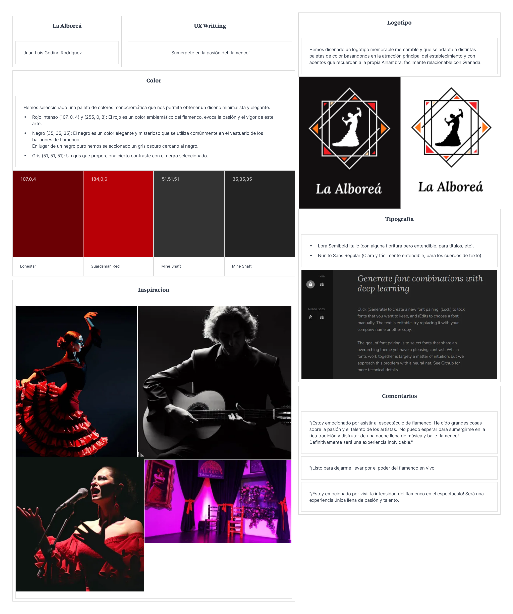
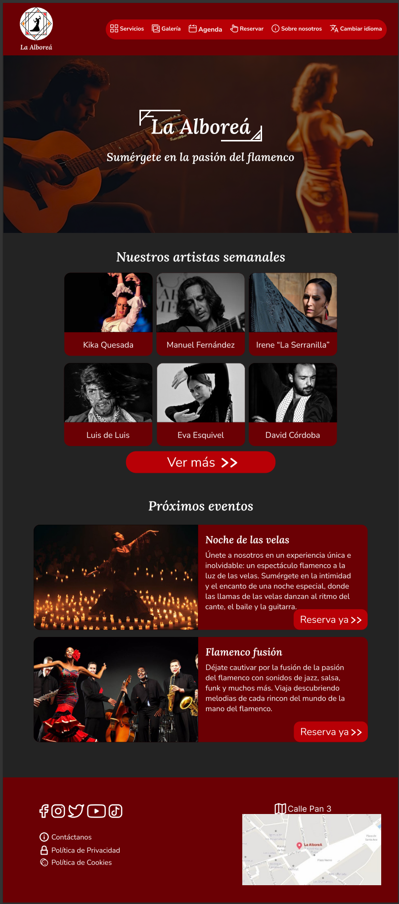
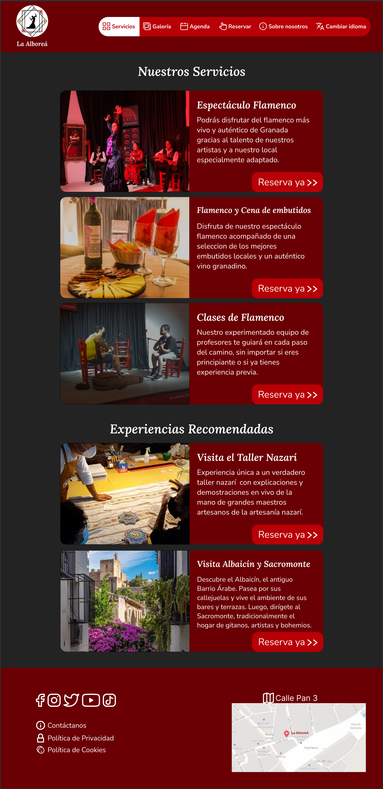
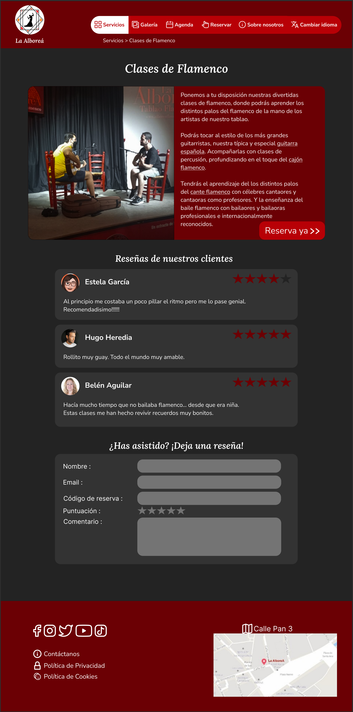
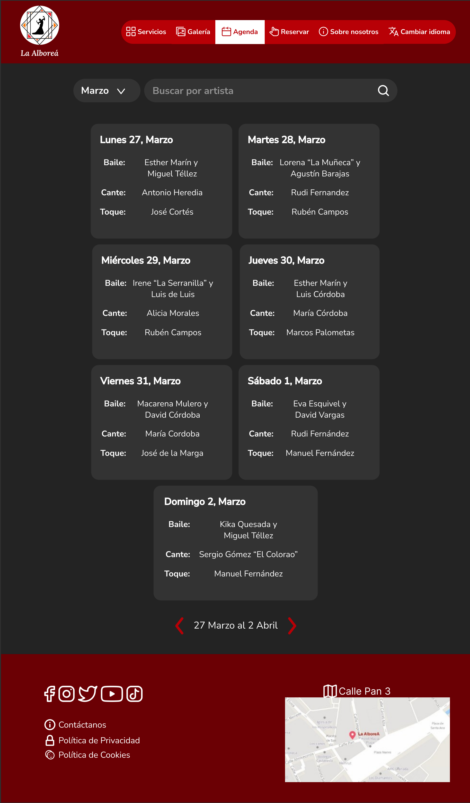
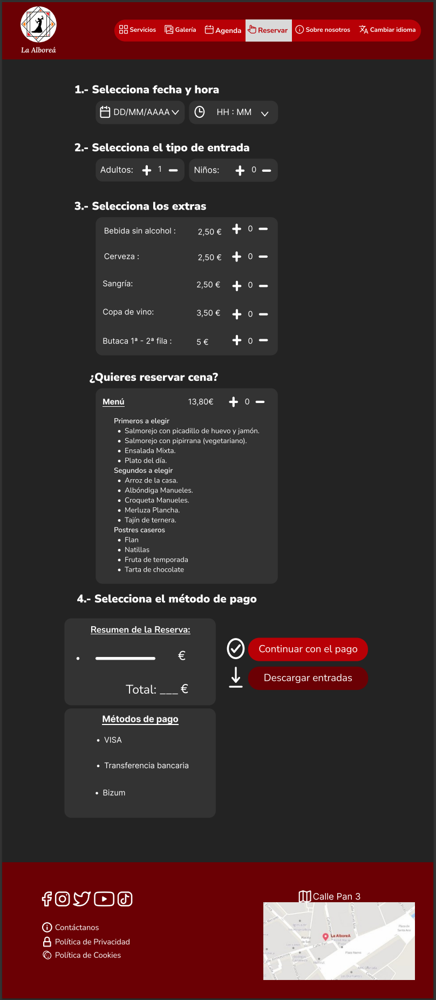

# DIU - Practica 3, entregables

## Moodboard (diseño visual + logotipo)   
>>> 
>>>
>>> Para el logotipo hemos escogido una representación que pensamos que es facilmente relacionable con el flamenco junto con algunos adornos que recuerdan a decoraciones nazaries tipicas de Granada. Además de ser memorable, se adapta con facilidad a distintas paletas de colores.
>>> Hemos seleccionado una paleta monocromática acorde a colores tradicionales del flamenco como son el rojo y el negro.
>>> Para la tipografica hemos seleccionado 2 fuentes que contrastan bastante entre si.
>>> - Lora Semibold Italic: Para headers, enonciados, etc. Llama la atención con las florituras que tiene pero sin sacrificar legibilidad.
>>> - Nunito Sans: Para cuerpos de texto o secciones que requieran buena legibilidad. Además de ser legible, aporta claridad a cuerpos de texto extensos.

## Landing Page
>>>(img/)

## Mockup: LAYOUT HI-FI
>>>En las siguientes imágenes se pueden apreciar las partes que hemos considerado más importantes de nuestra website. Algunas secciones de menos importancias no las hemos incluido.

>>>Homepage: Encontramos algunas artistas semanales destacados e información sobre próximos eventos.
>>>

>>>Apartado Servicios: Permite consultar informción sobre los distintos servicios ofrecidos y observados
>>>

>>> Apartado Servicios en detalle, donde podemos encontrar más información del mismo, en este caso; las clases de flamenco.
>>>

>>>Apartado Agenda de artistas: Se pueden consultar qué artistas actuan cada semana y tambíen se puede hacer una búsqueda por nombre del artista y mes.
>>>

>>>Apartado de Reservas: Permite reservar entradas para el espectáculo seleccionando la cantidad de adultos o niños, extras a incluir y la opción de cena. Al final aparece un desglose de la reserva actual, el total a pagar, diferentes opciones de pago y la opción de descargar las entradas una vez hecho el pago.
>>>

## Documentación: Publicación del Case Study

 
