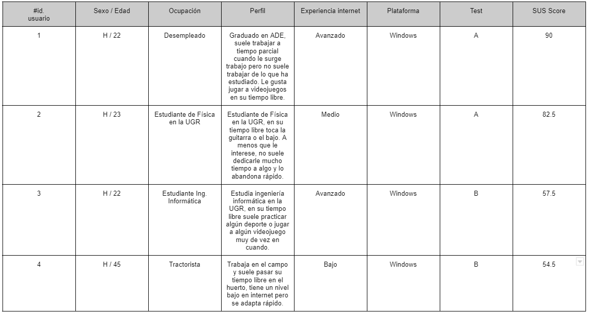
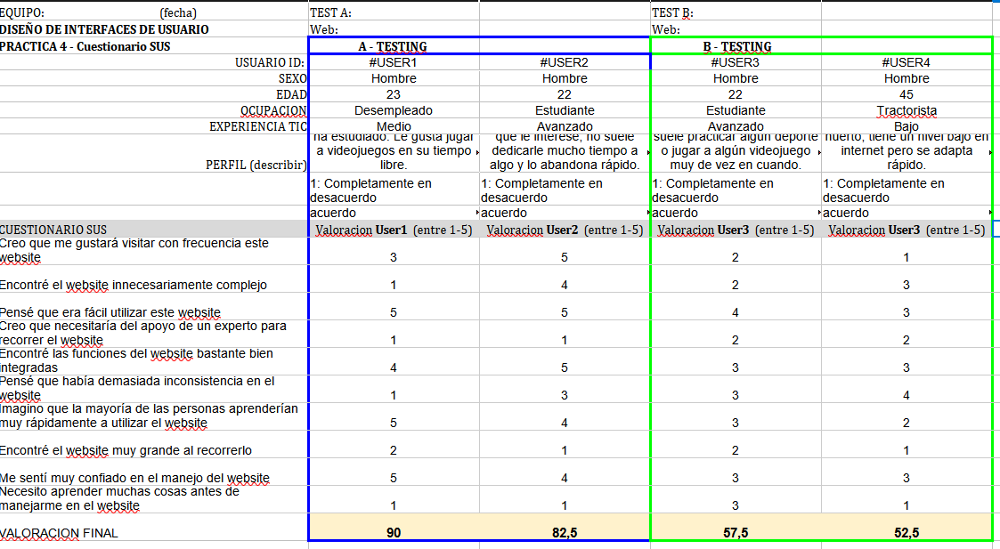

# DIU - Practica 4, entregables

## Users 

Para la realización de esta práctica hemos trabajado con 4 usuarios que nos han ayudado a realizar los test SUS.

Estos usuarios son: 

Cuyas necesidades son:

* **Usuario 1:** Hace poco ha oído que suele escuchar en spotify va a actuar en La Alboreá y quiere asistir a una velada para escucharla en directo, pero no sabe qué día actúa exactamente. 

* **Usuario 2:** De vez en cuando suele hacer planes con sus amigos, esta vez vienen a Granada y le toca a él organizar algo, no dispone de mucho tiempo porque tiene que hacer informes de varias prácticas que tiene atrasados, así que no tiene mucha paciencia.

* **Usuario 3:** Debe hacer un cursillo relacionado con la artesanía de Granada y no le parece que haya mejor opción que asistir presencialmente a un taller, pero no solo para recabar información, ya de paso, para pasarselo bien.

* **Usuario 4:** Hace poco vió por Andalucía Directo, en televisión, un taller de artesanía nazarí y a sus hijos les gustó mucho el programa. Como ambos han sacado buenas notas en el colegio ha decidido organizarles uno de estos talleres por sorpresa.

## A/B Testing. 
Tras realizar el cuestionario SUS a estos usuarios, hemos obtenido los siguientes resultados: 

## Usability Report de Caso B
Con los datos obtenidos en el cuestionario SUS hemos realizado un usability report del caso que se nos ha asignado.

## Conclusiones
Hemos llegado a la siguiente serie de conclusiones sobre el caso que se nos ha asignado:

- No tenemos ningún tipo de breadcrumb que permita a los usuarios saber en qué sección se encuentran de forma rápida más allá de título (que tampoco destaca mucho), lo que se agrava debido a la similitud estructural de algunas secciones como “Carrito”, “Favoritos” e “Historial”.
- Se pueden consultar reseñas sobre las actividades pero es imposible añadir una nueva reseña a estas.
- Ciertos botones redirigen a secciones que no tienen sentido o que dificultan alguna tarea, algunos ejemplos son:
	- En el caso de querer añadir varias actividades desde la sección de favoritos, se redirige directamente al carrito, dificultando la reserva de varias de estas actividades desde aquí.
	- En la sección de más información sobre la actividad, existen múltiples botones con una interpretación similar, uno lleva a la personalización de la actividad, mientras que el otro, a la homepage.

